# Changelog

All notable changes to this project will be documented in this file.

The format is based on [Keep a Changelog](https://keepachangelog.com/en/1.0.0/)

## [4.0] - 2022-11-04

We're quadruple excited to announce the version 4.0 of **`NüRoom`**!

This major release fully focuses on Reflection about our Excellent Work

### Major changes

- `Documentation:` "Report Part 4" has been created which includes our reflections and experiments about each of our Design Pattern. A big thanks to [the contributors!](https://github.com/SWEN900072022/SWEN90007-2022-NuRoom#contributors-:~:text=this%20project%3A%20Changelog-,Contributors,-%E2%9C%A8)
- `Development:` None!!

## [3.0] - 2022-10-20

We're Triple excited to announce the version 3.0 of **`NüRoom`**!

This major release fully focuses on Concurrency Design Patterns implementation

### Major changes

- `Product:` Now, our customers will have the power to search accommodations, book rooms, create accounts, and many more! Concurrently!!!!!
- `Documentation:` "Report Part 3" has been created which includes diagrams and descriptions of each Concurrent Design Pattern. A big thanks to [the contributors!](https://github.com/SWEN900072022/SWEN90007-2022-NuRoom#contributors-:~:text=this%20project%3A%20Changelog-,Contributors,-%E2%9C%A8)
- `Development:` Cool design patterns and automated concurrency testing has been implemented!

### Changed features

- `Documentation`: Report for the second submission which includes:
    - Updated System class diagram
    - Concurrency Design Pattern descriptions
    - Jmeter concurrency testing results
    
- `Implementation`: Profesional and Robust implementation of the following functionalities:
    - Design Patterns implemented:
        - Optimistic Offline Lock
        - Pessimistic Offline Lock
        - Database Constraint

## [2.0] - 2022-09-21

We're doubly excited to announce the version 2.0 of **`NüRoom`**!

This major release fully focuses on Design Patterns implementation

### Major changes

- `Product:` Now, our customers will have the power to search accommodations, book rooms, create accounts, and many more!
- `Documentation:` "Report Part 2" has been created which includes diagrams and descriptions of each Design Pattern. A big thanks to [the contributors!](https://github.com/SWEN900072022/SWEN90007-2022-NuRoom#contributors-:~:text=this%20project%3A%20Changelog-,Contributors,-%E2%9C%A8)
- `Development:` Cool design patterns and automated testing has been implemented!

### Changed features

- `Documentation`: Report for the second submission which includes:
    - Updated use case diagram
    - Updated list of use cases
    - Class diagram
    - Design Pattern descriptions
    
- `Implementation`: Profesional and Robust implementation of the following functionalities:
    - Improving CI/CD Process: [Automated Testing](https://github.com/SWEN900072022/SWEN90007-2022-NuRoom/actions) included into our auto-deploys
    - Design Patterns implemented:
        - Domain model
        - Data mapper
        - Unit of work
        - Lazy load
        - Identity field
        - Foreign key mapping
        - Embedded value
        - Single table inheritance
        - Authentication and Authorization

- `Product`: Functionalities and more functionalities for our lovely users!
    - New **Customer** functionalities:
        - Search for stays
            
        - Make a hotel booking
            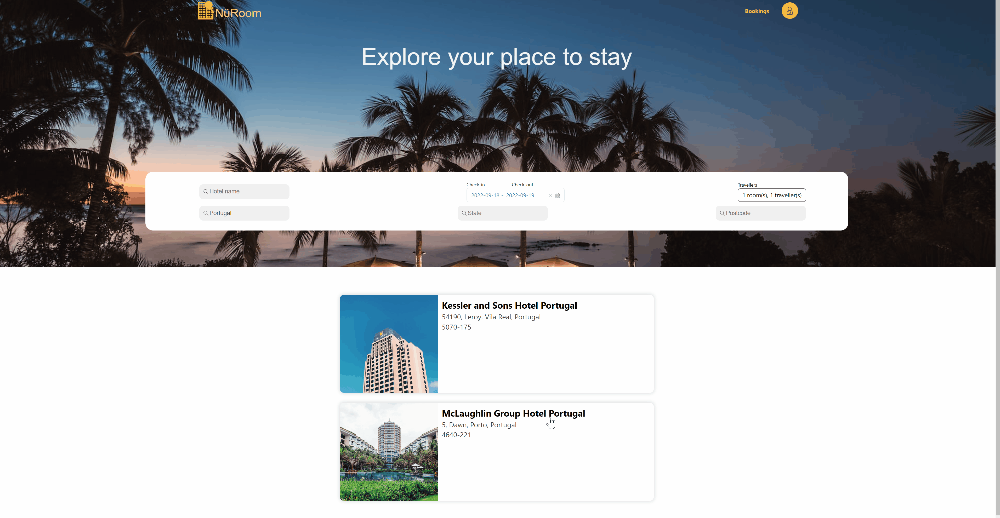
        - View prior and future hotel bookings
            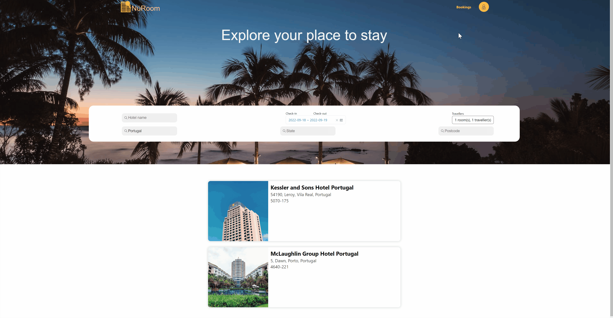
        - Modify a booking
            - Add more people
                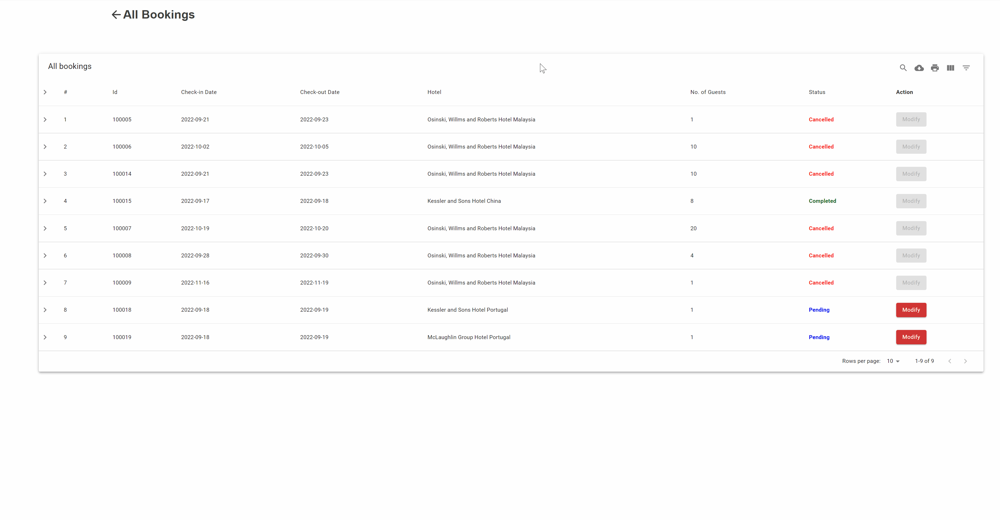
            - Change dates
                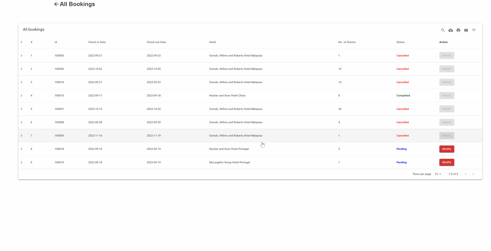
            - Cancel booking
                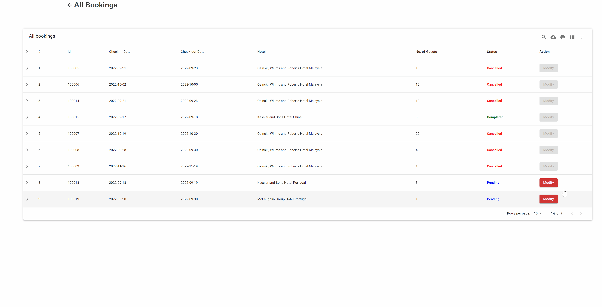
    - New **Hotelier** functionalities:
        - Create hotel for a group
            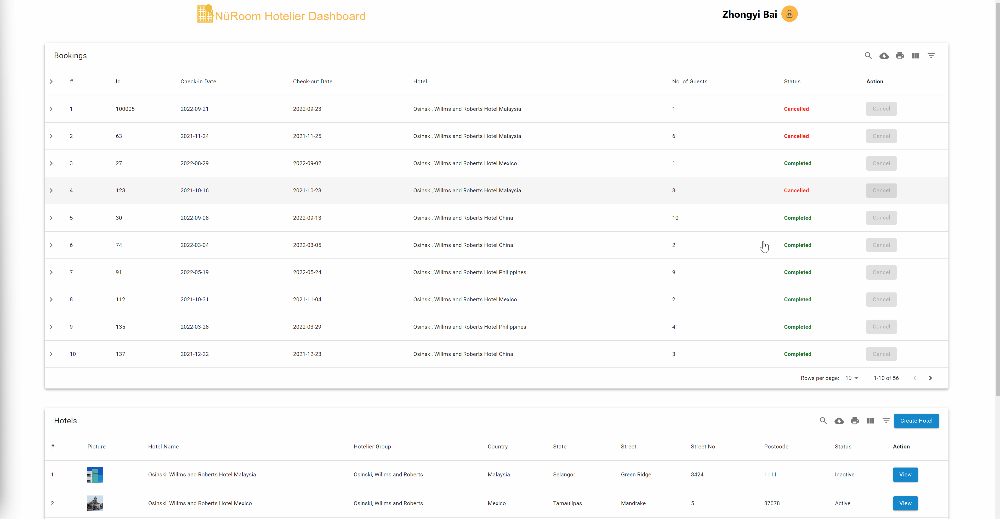
        - Create hotel rooms for a hotel
            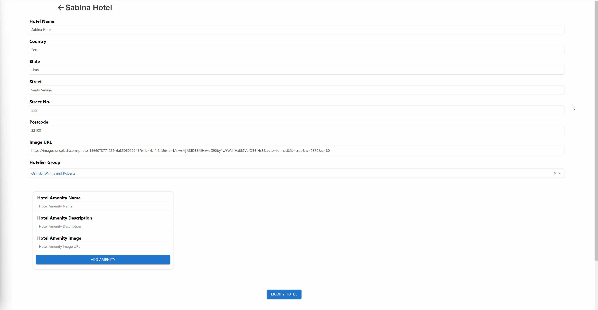
        - View all bookings tied to Hotelier group
            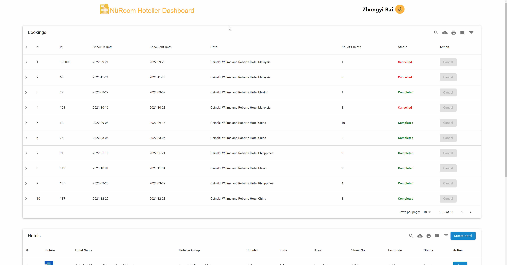
        - Modify a booking
            - Cancel the booking
                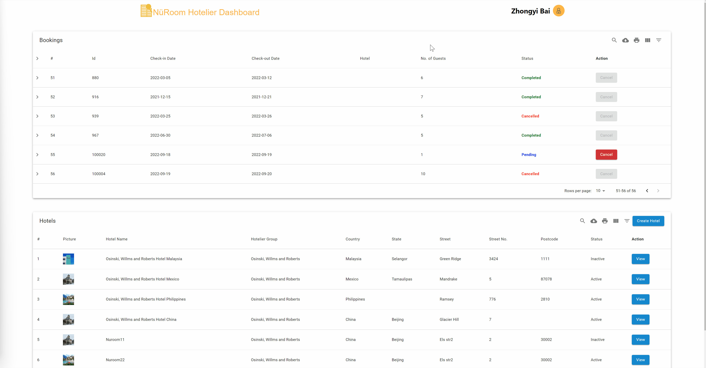
    - New **Administrator** functionalities:
        - View all users of the system
            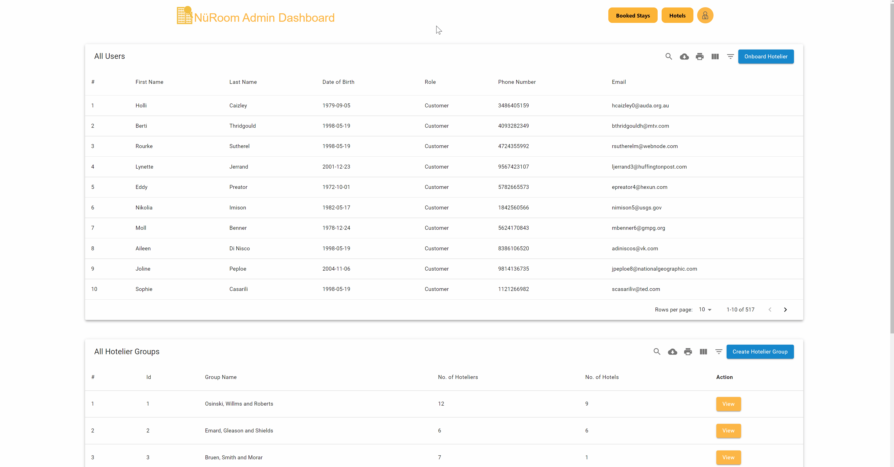
        - Remove hotel listing
            
        - Onboard Hotelier users
            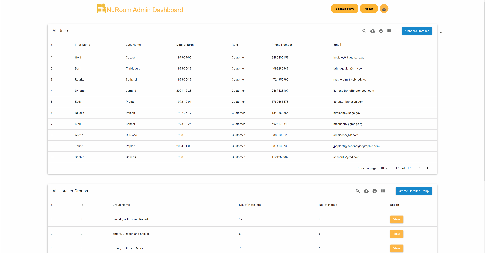
        - Create a Hotelier group
            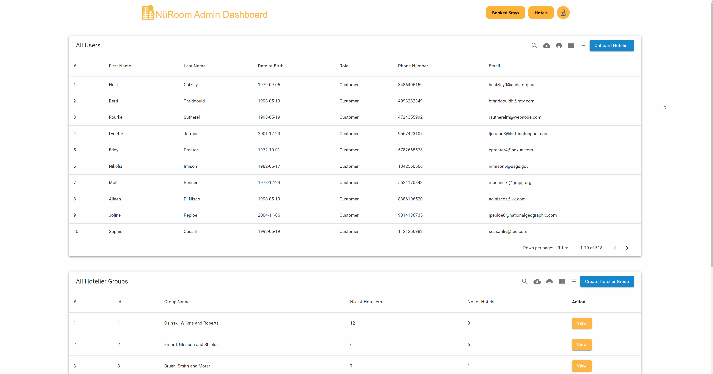
        - Add/remove Hoteliers in a Hotelier group
            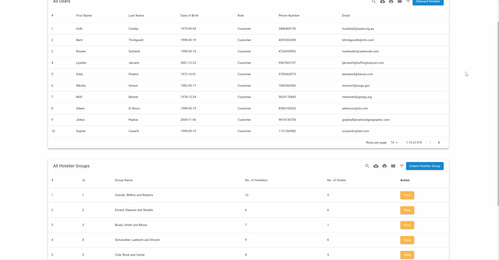

## [1.0] - 2022-08-15

We're super excited to announce the version 1.0 of `NüRoom`!

This major release fully focuses on creating the repository

### Major changes

- `Report-Part 1.pdf` has been created with a cool logo and a big thanks to the contributors.
- `First Deploy` has been done to Heroku!

### Changed features

- `Report-Part-1.pdf`: Report for the first submission which includes:
    - Use case diagram
    - List of use cases
    - Domain model diagram
    - Domain model explanation
- `First Deploy`: First automatic deploy of our QA Branch done sucessfully:
    - Tomcat 9.0.30.0
    - Java 11.0.15

## [0.0] - 2022-08-07

We're super excited to announce `NüRoom`!

This major release fully focuses on creating the repository

### Major changes

- `README.md` has been created with cool pictures of the contributors.
- `First push` has been done!

### Changed features

- Here we will be listing details of each feature!